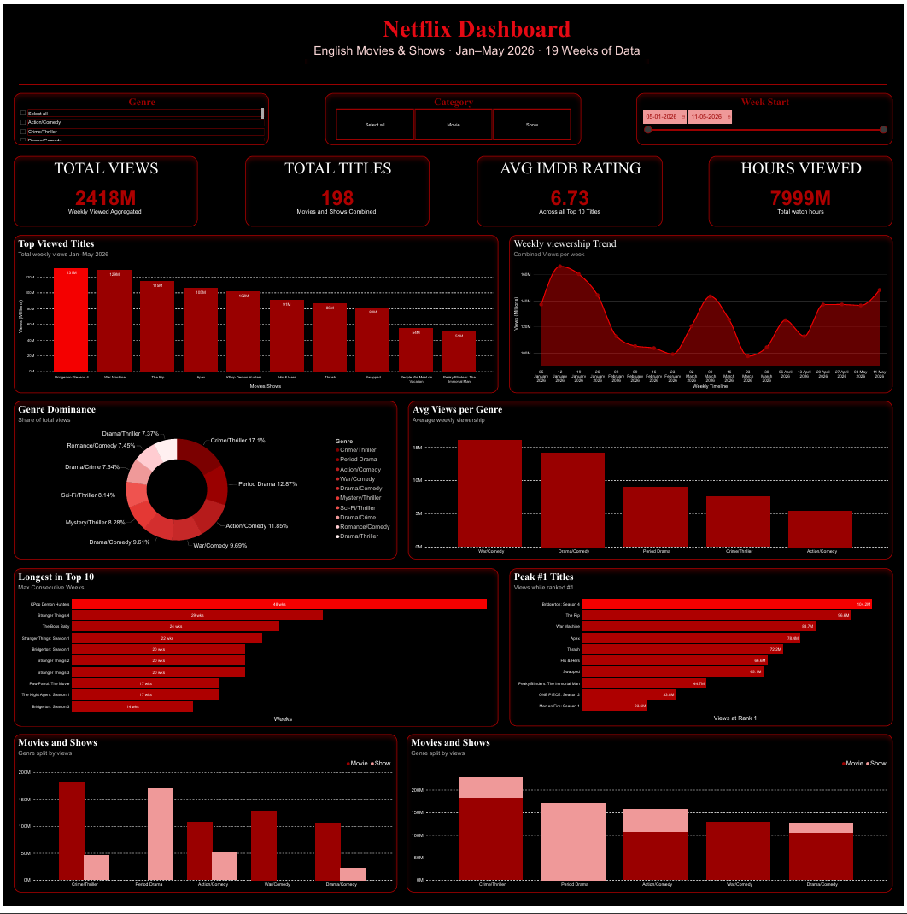

# 🎬 Netflix Top 10 Performance Analysis
### Jan–May 2026 | English Movies & Shows



---

## 📌 Project Overview

A data-driven analysis of Netflix's most-watched content using **real weekly viewership data** collected from the official Netflix Top 10 chart.

The project covers the full data pipeline — from raw collection and cleaning to interactive dashboard and business insights.

---

## 📂 Dataset

| Detail | Info |
|---|---|
| **Source** | [netflix.com/tudum/top10](https://www.netflix.com/tudum/top10) |
| **Time Period** | January 5 – May 17, 2026 (19 weeks) |
| **Categories** | English Movies & English Shows |
| **Total Rows** | 380 |
| **Unique Titles** | 198 |
| **Columns** | 12 (views, hours watched, genre, IMDB rating, runtime, etc.) |

---

## 🛠️ Tools Used

| Tool | Purpose |
|---|---|
| **Excel** | Data collection, cleaning, and pivot tables |
| **Python (Pandas)** | Data validation and deeper cleaning |
| **Power BI** | Interactive dashboard and visualizations |

---

## 🧹 Data Cleaning

Data was manually collected each week and required cleaning before analysis.

**Movies Sheet** — 6 issues found and fixed  
**Shows Sheet** — 4 issues found and fixed

Issues fixed included:
- Wrong number formats (`1,72,00,000` → `17200000`)
- Runtime format converted (`HH:MM:SS` → decimal hours)
- Column name typo (`Ttitle` → `Title`)
- Genre spelling mistakes (`Documentry` → `Documentary`)
- Title whitespace (` KPop Demon Hunters` → `KPop Demon Hunters`)

---

## 📊 Dashboard

An interactive Power BI dashboard was built with the following visuals:

- **KPI Cards** — Total Views, Total Titles, Avg IMDB Rating, Hours Viewed
- **Top Viewed Titles** — Bar chart of most-watched content
- **Weekly Viewership Trend** — Combined views per week over 19 weeks
- **Genre Dominance** — Donut chart showing genre share of total views
- **Avg Views per Genre** — Bar chart of average weekly viewership by genre
- **Longest in Top 10** — Max consecutive weeks each title held a Top 10 spot
- **Peak #1 Titles** — Views while ranked #1
- **Movies vs Shows by Genre** — Split bar charts comparing both categories

**Filters available:** Genre, Category (Movie/Show), Week Start range

---

## 🔑 Key Findings

### 1. Top Performers
- **Bridgerton Season 4** — Most total views (**131M**)
- **War Machine** — Highest single-week views (**44.4M**, week of Mar 9)
- **K-Pop Demon Hunters** — Longest in Top 10 (**48 consecutive weeks**)

### 2. Movies vs Shows
- Movies drive more views (**1.40B vs 1.02B** — 58% share)
- Shows rate higher on IMDB (**7.21 vs 6.26**)
- **Movies = Reach · Shows = Quality**

### 3. Genre Trends
- **Crime/Thriller** dominates with **17.1%** of total views (**226.8M**)
- **Period Drama** is the strongest genre for Shows
- **Action/Comedy** is the strongest genre for Movies
- Thriller content is Netflix's winning formula

---

## 💡 Recommendations

1. **Greenlight more Crime/Thriller content** — consistently highest views across both categories
2. **Invest in animated/family content** — K-Pop Demon Hunters held Top 10 for 48 weeks, showing exceptional longevity
3. **Differentiate success metrics** — Shows need a quality focus; Movies need a reach focus

---

## 📁 Repository Structure

```
netflix-top10-analysis/
│
├── Clean Data Movie.xlsx     # Cleaned, analysis-ready data
├── data_cleaning.py          # Python cleaning script (Pandas)
├── Netflix.pdf               # Project presentation
├── dashboard_screenshot.png  # Power BI dashboard screenshot
└── README.md
```

---

## 👩‍💻 Author

**Lavina Saini** — Data Analytics Intern  
📅 Project Date: May 26, 2026

---

## 📜 Data Source

Data collected manually from the official Netflix viewership chart:  
🔗 [https://www.netflix.com/tudum/top10](https://www.netflix.com/tudum/top10)

> *This project is for educational and portfolio purposes only.*
